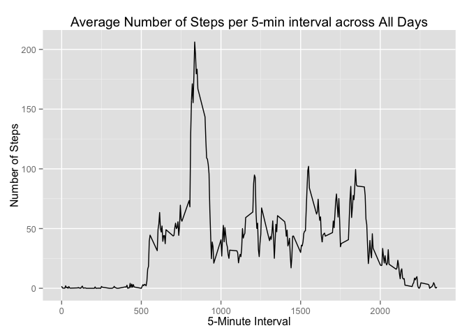

# Reproducible Research: Peer Assessment 1
Ricardo Quintana  

The goal of this assignment is to practice skills needed for reproducible research. Specifically this assignment uses R markdown to write a report that answers the questions detailed in the sections below. In the process, the single R markdown document will be processed by knitr and be transformed into an HTML file.

The assignment starts by forking the [GitHub repository created for this
assignment](http://github.com/rdpeng/RepData_PeerAssessment1).The assignment is submitted by pushing the completed files into the
forked repository on GitHub.

This assignment makes use of data from a personal activity monitoring
device. This device collects data at 5 minute intervals through out the
day. The data consists of two months of data from an anonymous
individual collected during the months of October and November, 2012
and include the number of steps taken in 5 minute intervals each day.

## Data

The data for this assignment can be downloaded from the course web
site:

* Dataset: [Activity monitoring data](https://d396qusza40orc.cloudfront.net/repdata%2Fdata%2Factivity.zip) [52K]

The variables included in this dataset are:

* **steps**: Number of steps taking in a 5-minute interval (missing
    values are coded as `NA`)

* **date**: The date on which the measurement was taken in YYYY-MM-DD
    format

* **interval**: Identifier for the 5-minute interval in which
    measurement was taken

The dataset is stored in a comma-separated-value (CSV) file and there
are a total of 17,568 observations in this
dataset.


## Loading and preprocessing the data

Show any code that is needed to:

1. Load the data (i.e. `read.csv()`)
2. Process/transform the data (if necessary) into a format suitable for your analysis  


```r
# Data already unzipped as unzip results might vary with platform
data <- read.csv("activity.csv")
# Process/transform Data
#data$interval <- as.factor(data$interval)
data$date <- as.Date(data$date) 
```

## What is mean total number of steps taken per day?

For this part of the assignment, you can ignore the missing values in the dataset.

1. Calculate the total number of steps taken per day

```r
steps_per_day <- aggregate(steps ~ date, data=data, FUN=sum)
# Check that no NA values are produced frim the sum.
sum(is.na(steps_per_day[,"steps"]))
```

```
## [1] 0
```

2. Make a histogram of the total number of steps taken each day

```r
hist(steps_per_day$steps, xlab="Total steps per day", 
     breaks=10,
     main="Histogram of Steps per day")
```

 

3. Calculate and report the **mean** and **median** of the total number of steps taken per day

```r
mean(steps_per_day$steps)
```

```
## [1] 10766.19
```

```r
median(steps_per_day$steps)
```

```
## [1] 10765
```


## What is the average daily activity pattern?
1. Make a time series plot (i.e. `type = "l"`) of the 5-minute interval (x-axis) and the average number of steps taken, averaged across all days (y-axis)

```r
daily_pattern <- aggregate(steps ~ interval, data=data, FUN=mean)
library(ggplot2)
qplot(x=interval, y=steps, data = daily_pattern,  geom = "line",
      xlab="5-Minute Interval",
      ylab="Number of Steps",
      main="Average Number of Steps per 5-min interval across All Days"
      )
```

 

2. Which 5-minute interval, on average across all the days in the dataset, contains the maximum number of steps?

```r
subset(daily_pattern, steps==max(daily_pattern$steps), select=interval)
```

```
##     interval
## 104      835
```

5-minute interval from 08:35am to 08:40am contains the maximum average number of steps. 

## Imputing missing values
Note that there are a number of days/intervals where there are missing
values (coded as `NA`). The presence of missing days may introduce
bias into some calculations or summaries of the data.

1. Calculate and report the total number of missing values in the dataset (i.e. the total number of rows with `NA`s)

```r
summary(data)
```

```
##      steps             date               interval     
##  Min.   :  0.00   Min.   :2012-10-01   Min.   :   0.0  
##  1st Qu.:  0.00   1st Qu.:2012-10-16   1st Qu.: 588.8  
##  Median :  0.00   Median :2012-10-31   Median :1177.5  
##  Mean   : 37.38   Mean   :2012-10-31   Mean   :1177.5  
##  3rd Qu.: 12.00   3rd Qu.:2012-11-15   3rd Qu.:1766.2  
##  Max.   :806.00   Max.   :2012-11-30   Max.   :2355.0  
##  NA's   :2304
```

```r
sum(is.na(data$steps))
```

```
## [1] 2304
```

2. Devise a strategy for filling in all of the missing values in the dataset. The strategy does not need to be sophisticated. For example, you could use the mean/median for that day, or the mean for that 5-minute interval, etc.

```r
# Filling in all of the missing values in the dataset. Replace NA with mean for that 5-minute interval
imputed_data <- data
for (i in which(is.na(data$steps))) {
    imputed_data[i, "steps"] <- subset(daily_pattern, interval==imputed_data[i, "interval"], select=steps)
}
```

3. Create a new dataset that is equal to the original dataset but with the missing data filled in.

```r
steps_per_day2 <- aggregate(steps ~ date, data=imputed_data, FUN=sum)
hist(steps_per_day2$steps, xlab="Total steps per day", 
     breaks=10,
     main="Histogram of Steps per day (imputed)")
```

 

4. Make a histogram of the total number of steps taken each day and Calculate and report the **mean** and **median** total number of steps taken per day. Do these values differ from the estimates from the first part of the assignment? What is the impact of imputing missing data on the estimates of the total daily number of steps?

```r
mean(steps_per_day2$steps)
```

```
## [1] 10766.19
```

```r
median(steps_per_day2$steps)
```

```
## [1] 10766.19
```
The values do not differ significantly from the first par of the assignment.  
The shape of the histogram remains the same as the histogram from removed missing values. However, the frequency counts increased as expected. In this case, it seems that the data imputation strategy should work for the downstream data analysis and modeling.

## Are there differences in activity patterns between weekdays and weekends?
For this part the `weekdays()` function may be of some help here. Use the dataset with the filled-in missing values for this part.

1. Create a new factor variable in the dataset with two levels -- "weekday" and "weekend" indicating whether a given date is a weekday or weekend day.

```r
imputed_data$daytype <- as.factor(ifelse(weekdays(imputed_data$date) %in% 
                c("Saturday","Sunday"), "weekend", "weekday"))

pattern_weekday <- aggregate(steps ~ interval+daytype, data=imputed_data, 
                             FUN=mean)
```

2. Make a panel plot containing a time series plot (i.e. `type = "l"`) of the 5-minute interval (x-axis) and the average number of steps taken, averaged across all weekday days or weekend days (y-axis).

```r
library("lattice")
p <- xyplot(steps ~ interval | factor(daytype), data=pattern_weekday, 
       type = 'l',
       main="Average Number by interval",
       xlab="5-Minute Interval",
       ylab="Steps")
print(p)
```

 

There are differences in activity patterns between weekdays and weekends. The plot indicates that the person moves around more throughout the day (is more active) during the weekend.
